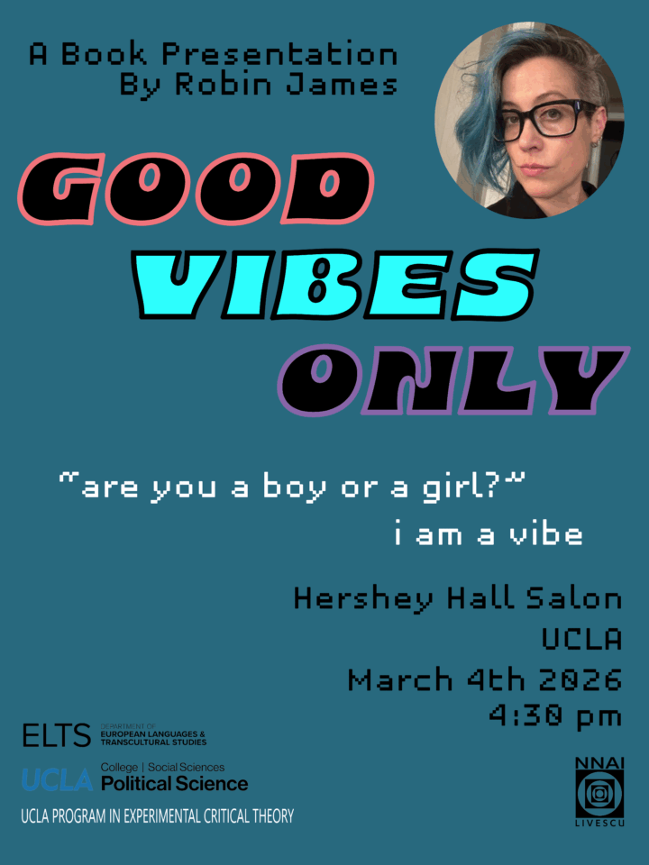
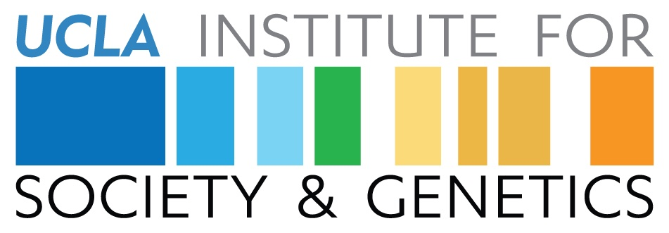

* * *

We are partnering with the [UCLA Political Science Department](https://polisci.ucla.edu/), [UCLA Program in Experimental Critical Theory](https://ect.humspace.ucla.edu/), and the [UCLA Department of European Languages and Transcultural Studies](https://elts.ucla.edu/) to host a talk by renowned independent scholar and editor [Dr. Robin James](https://www.its-her-factory.com/) about her upcoming book, "_[**Good Vibes Only**](https://www.its-her-factory.com/publications/)"_.

[Register Now](https://docs.google.com/forms/d/e/1FAIpQLSe9cvGwBi7C4MDAtz_0m75fyOtFuWfOKL5ocCLRwVLWwNOJaQ/viewform?usp=publish-editor)

A follow-up to _[**The Sonic Episteme**](https://www.dukeupress.edu/the-sonic-episteme)_, this book attends to the relationship between biopower’s quantitative and qualitative dimensions. My previous book demonstrated the ways sound, as a frequency, was used to translate statistical normalization, or the measurement of the most frequent frequencies in a population, into qualitative terms. This book argues that phenomenological orientation or horizon has a similar function in contexts such as recommender algorithms and the density models used in contemporary AI and Machine Learning where probability is modeled as something other than a normalized distribution. Phenomenology is uniquely well-suited to theorize these models that as Amoore, Cooper, Joque, and others have argued, blend hard math with subjective intuition, as (per philosophers like Shiloh Whitney), phenomenology, unlike affect theory, rejects the strict separation between what we can very loosely call “mind” and “body” (cognitive content and felt sense).

These mathematical models have been vernacularized as “vibes”, which are qualitative categories that everyone from 2020s social media users to music streaming services use to define the same sorts of orientations or tendencies that vectors model mathematically. “Vibes” are a lay term for more or less the same phenomenon philosophers call phenomenological orientations or horizons. Studying late 2010s and early 2020s internet culture and American popular music from the 1970s through today, the book shows how orientations are policed not for their normativity, but for their lineage – or rather, their capacity to carry forward the patriarchal racial capitalist distribution of wealth and personhood into presently-counterfactual realities. Then, in the final chapter, I argue that although my theory and critique of the biopolitics of algorithmic legitimation is grounded in 21st century Anglophone feminist of color phenomenology, the fact of orientation not inherently or necessarily critical of patriarchal racial capitalist power relations—Heidegger’s whole project is oriented towards what he calls “spiritual National Socialism.”  In order to orient ourselves otherwise, what matters is to whom we collectively choose to orient ourselves toward, and from whom we orient ourselves away. In this respect, Beauvoir’s existential phenomenology, which frames (re)orientation or (re) “situation” as a matter of choosing some people and some values over (and against) others, is a helpful theoretical model for imagining how we might do phenomenology otherwise.

* * *

#### **Event Details**

- Date & Time: March 4th 2026 at 4:30 pm

- Location: Hershey Hall Salon, Hershey Hall, UCLA

- Please **[RSVP](https://docs.google.com/forms/d/e/1FAIpQLSe9cvGwBi7C4MDAtz_0m75fyOtFuWfOKL5ocCLRwVLWwNOJaQ/viewform?usp=publish-editor)** in advance**, there is limited seating available**

Don’t miss this opportunity to engage with critical ideas on data, democracy, and equality.

* * *

## Join Our Newsletter

\[mailerlite\_form form\_id=1\]

## Connect

**UCLA Institute for Society and Genetics**  
621 Charles E. Young Dr. South  
Box 957221, 3360 LSB  
Los Angeles, CA 90095-7221

\[gravityform id="1" title="true"\]
