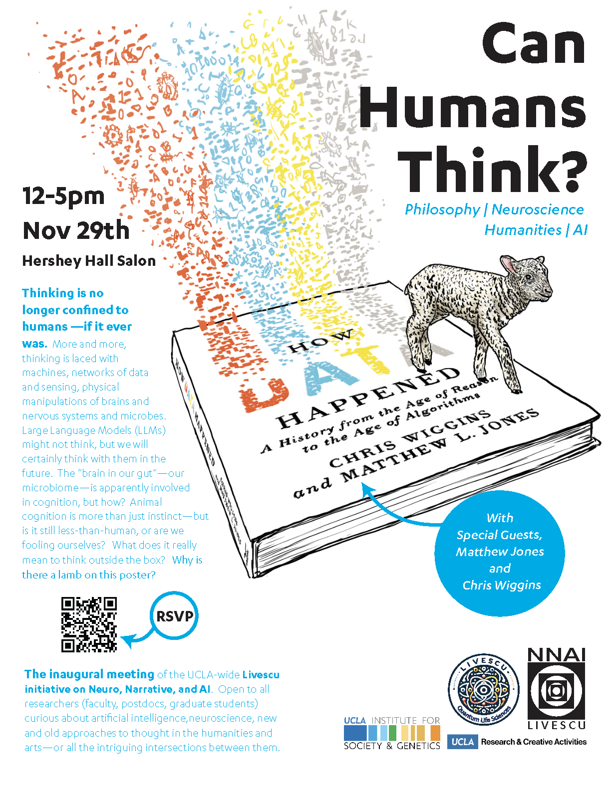

* * *

* * *

Inaugural talk by _**[Matthew Jones](https://history.princeton.edu/people/matthew-l-jones)**_ and _**[Chris Wiggins](https://datascience.columbia.edu/people/chris-h-wiggins/)**_, authors of “[How Data Happened](https://wwnorton.com/books/how-data-happened)”, titled _**Can Humans Think? Philosophy, Neuroscience, Artificial Intelligence, Humanities**_

Thinking is no longer confined to humans — if it ever was. More and more, thinking is laced with machines, networks of data and sensing, physical manipulations of brains and nervous systems and microbes. Large Language Models (LLMs) might not think, but we will certainly think with them in the future. The "brain in our gut" — our microbiome — is apparently involved in cognition, but how? Animal cognition is more than just instinct —but is it still less-than-human, or are we fooling ourselves? What does it really mean to think outside the box? Why is there a lamb on this poster?

* * *

### Event Details

- November 29 2023, from 12 pm - 5pm

- Hershey Hall, Hershey Hall Salon, UCLA, Los Angeles, CA

* * *

## Join Our Newsletter

\[mailerlite\_form form\_id=1\]

## Connect

**UCLA Institute for Society and Genetics**  
621 Charles E. Young Dr. South  
Box 957221, 3360 LSB  
Los Angeles, CA 90095-7221

\[gravityform id="1" title="true"\]
