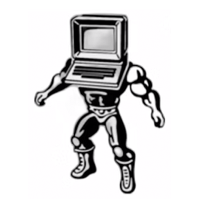
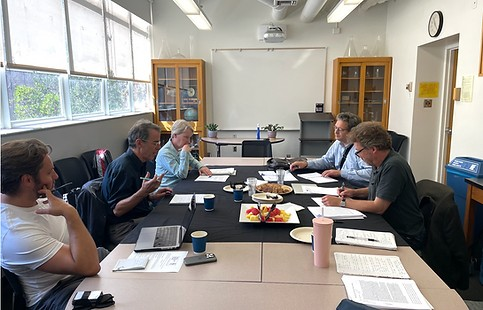
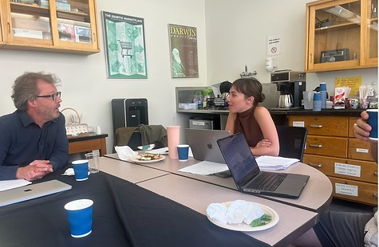

* * *

* * *

We organized a workshop on September 2024 at the [Institute for Society & Genetics](https://socgen.ucla.edu/), UCLA on the topic of midcentury brain science. Cross-fertilizing cultural, political, intellectual, and technical-scientific history, this workshop’s contributions ask: How did the midcentury brain sciences ramify across cultural and political discourses, and simultaneously, how did these discourses shape the technical affordances and practices of these brain sciences?

In our view, this workshop would accomplish two major aims at once. First, it would scaffold the social and intellectual network for the Material Intelligence as Historical Problem working group, most notably securing footholds for future collaboration with influential research centers and resources in France, Germany, Switzerland, and the US. Second, it would model the type of scholarly intervention our working group will platform: scholarship (in history, sociology, and so on) that weds technical literacy with an ambitious interdisciplinary remit, in order to critique the discourse of novelty rather than taking it as its starting point.

* * *

## Participants

- Cornelius Borck (University of Lubeck, Germany)

- Andreas Killen (CUNY, USA)

- Danielle Carr (UCLA, USA)

- Yvan Prkachin (University of Zurich, Switzerland)

- Nadine Weidman (Harvard, USA)

- Jean Gael Barbara (CNRS, France)

* * *

## Join Our Newsletter

\[mailerlite\_form form\_id=1\]

## Connect

**UCLA Institute for Society and Genetics**  
621 Charles E. Young Dr. South  
Box 957221, 3360 LSB  
Los Angeles, CA 90095-7221

\[gravityform id="1" title="true"\]
