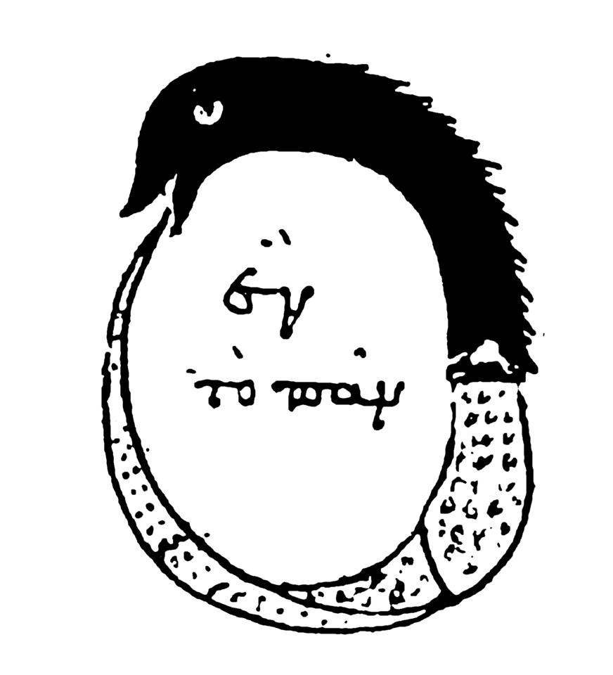

* * *

* * *

A philosophically interesting concern has also emerged in around Artificial Intelligence (AI) in the last year or so. "Model Autophagy Disorder" (MAD) also called "model collapse" is a phenomenon that several different research groups have now experimentally demonstrated (see the papers by [Alemohammad et. al.](https://openreview.net/forum?id=ShjMHfmPs0), [Shumailov et. al.](https://www.nature.com/articles/s41586-024-07566-y), and a recent [NYtimes article](https://www.nytimes.com/interactive/2024/08/26/upshot/ai-synthetic-data.html)). The basic insight is that when AI models generate things—text, images, sound—and then those generated products are used to train a subsequent model, the new model actually gets worse at generating images and texts. Over a few generations it can fail completely, producing only a string of gibberish or a single same image over and over again.

AI models trained on a very large data set map out all the statistical relations among all the elements in that set in the layers and loops of their neural nets. When a user prompts the model, it can produce a really nice—but always statistically simpler—mishmash of a bunch of different images or sentences it has seen in the data. It isn't really generating anything new because it's fundamentally constrained by it the training set: it produces novel reconfigurations, including things no human has ever seen before, but it doesn't make new data.

Now, if a new generation of an AI model is trained on those "statistically simpler" images, the next generation will be simpler yet, and so on. There is a lot of devil-in-the-details math in "statistically simpler" but the basic idea is that if you don't train the model with newer and better data, model autophagy can lead to MADness: worse and worse outputs, convergence to narrower and narrower distributions.

The answer seems to be that we need more data: "real" data not synthetic data. The largest AI models have already consumed some huge percentage—how much is unknown—of the available digital images (and text, and sound) on the internet. These are images that have been produced or digitized in the last 25 years or so. The rush to digitize everything in that period has created an extremely large body of data—but apparently not large enough! Where is this "new" digital data going to come from? It can't come from AI itself, given the risk of MADness. What's worse, these days many people are less enthusiastic about making their images or texts openly available because AI companies have shown that they have little regard for things like copyright or permission to ingest those images or texts. This has convinced a lot of people that a solution is to use "synthetic data" instead—data produced by AIs. And this is what has researchers worried about future models.

If models go MAD, what will that mean? The answer to this probably depends heavily on the context. It's not so significant that an image generator like Dall-E might not improve from where it is, or might get worse—bad news for OpenAI investors and people who can't draw. But as long as people keep learning to draw, paint and sketch, humans will be there to fill in where AI fails.

Where it might be more significant is in the areas where humans trust the output of AI models and act in response to them. If humans listen to the music that Spotify recommends and that changes the kind of music they make… or they trust the answers that ChatGPT gives them and they write articles that then reflect these answers… or they take the advice of an AI medical assistant and change their behavior in response to it… then the data these humans produce—presumptively "real" data— will not actually provide the diversity that AI needs to get better, rather than worse. We humans could end up helping AI go MAD the more we rely on and trust the output of the models!

Can it be fixed? MADness was particularly clear to engineers who work with control structures or feedback loops  
[Rich Baraniuk](https://dsp.rice.edu/) at Rice University, for instance, is thinking about how you model the "data manifold" in such a way that you can [measure the distance between data sets](https://arxiv.org/abs/2408.16333) so that when a model is trained it can discriminate better between rich and poor data. Baraniuk uses a simple analogy: When you are in the shower and the water is too hot, you turn it down, but if you turn it down too much it's suddenly too cold, so you turn it up again… until you get it right. AI Models might need the equivalent of a thermostat to keep from going mad. But it's tricky business: everyone's been in a shower that goes between scalding and freezing because the control is too sensitive.

At its core, Model Autophagy Disorder is about how we relate to the tools we use—whether we treat them as replacements for human skills and activities, or supplements to what humans do. The more AI is sold as a replacement—and the more people think of it as "freeing up" humans to do other things, the more [we define human intelligence as "things that AI can't do yet"](https://issues.org/ai-limits-human-aspiration-dick-chun-canute/), the worse the situation could get. As [Hubert Dreyfus put it over 50 years ago](https://en.wikipedia.org/wiki/Hubert_Dreyfus%27s_views_on_artificial_intelligence) in the book _What computers can't do_: "Our risk is not the advent of super-intelligent computers, but of subintelligent human beings."

Read more about Model Autophagy Disorder:

- _NYtimes_ ran a recent article: [https://www.nytimes.com/interactive/2024/08/26/upshot/ai-synthetic-data.html](https://www.nytimes.com/interactive/2024/08/26/upshot/ai-synthetic-data.html)

- _Nature_ reviews one of the papers here:[https://www.nature.com/articles/d41586-024-02355-z](https://www.nature.com/articles/d41586-024-02355-z)

- The Digital Signal Processing group at Rice University has collected a set of resources: [https://dsp.rice.edu/ai-loops/](https://dsp.rice.edu/ai-loops/)

* * *

## Join Our Newsletter

\[mailerlite\_form form\_id=1\]

## Connect

**UCLA Institute for Society and Genetics**  
621 Charles E. Young Dr. South  
Box 957221, 3360 LSB  
Los Angeles, CA 90095-7221

\[gravityform id="1" title="true"\]
