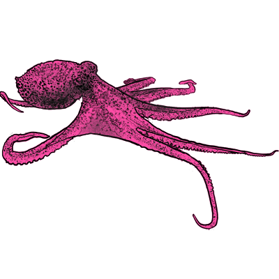

* * *

* * *

NNAI Livescu faculty seminars are designed by faculty around specific topics. We meet regularly over lunch to discuss a set of recommended literature pieces about a topic of interest.

* * *

### Schedule

- **Wed. Oct 2nd:**  Introductions and General Discussion

- **Wed. Oct 9th:**  Model Autophagy Disorder and Model Collapse

- **Wed. Oct 16th:** A talk with [Shazeda Ahmed](https://www.linkedin.com/in/shazeda-ahmed-89601967/)

- **Wed Oct 23rd:** A talk with [Frederick Gregory](https://www.linkedin.com/in/frederickdgregory-phd/)

- **Wed Nov 13th:** A talk with [Hongjing Lu](https://cvl.psych.ucla.edu/)

* * *

## Join Our Newsletter

\[mailerlite\_form form\_id=1\]

## Connect

**UCLA Institute for Society and Genetics**  
621 Charles E. Young Dr. South  
Box 957221, 3360 LSB  
Los Angeles, CA 90095-7221

\[gravityform id="1" title="true"\]
