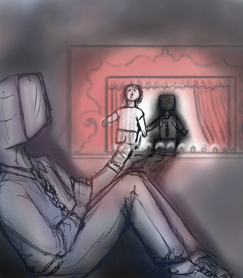

* * *

* * *

Talk by _[**Joshua F. Dienstag**](https://polisci.wisc.edu/staff/dienstag-joshua/),_ University of Wisconsin-Madison titled _**Why Turing Was Wrong: Machines, Language and Citizenship**_

The challenge that talking machines pose to traditional conceptions of the human is profound. If language activity is crucial to human status, then why should we not include talking machines in our community? What are our grounds for distinguishing computer-generated language from human language? Here I turn to Rousseau’s _**Letter to D’Alembert**_, a classic text that describes the illusions of the theatre and why we should not let our polity lose the ability to distinguish reality from fiction.  Our world is full of appearances that plausibly engage our emotions and our minds without being real.  The Turing test is deeply flawed just because it makes no attempt to distinguish the real from the apparent or fraudulent. But it is hardly beyond our capacity to do so.  Rather than Turing’s ‘imitation game’, I propose a reciprocity test that involves trust and honesty.

* * *

### **Event Details**

- December 12 2024 from 4pm - 5:30pm

- Royce 306, Royce Hall, UCLA Campus, Los Angeles, CA, USA

* * *

### **Media**

https://www.youtube.com/watch?v=TFQWtW\_bybw

* * *
