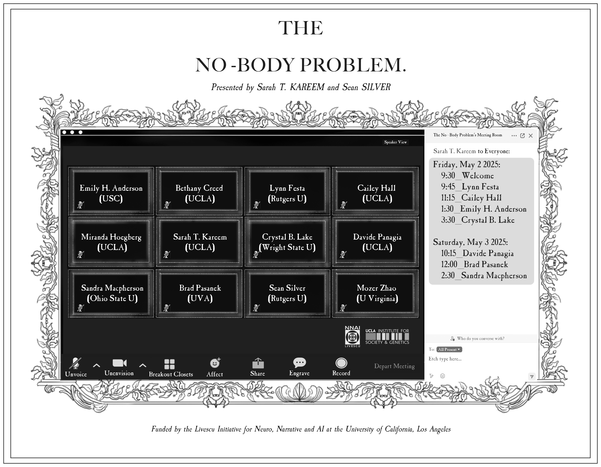

* * *

* * *

This workshop gathers a group of scholars working broadly in eighteenth-century studies under the heading of what we are calling “[The No-Body Problem](https://livescu.ucla.edu/the-no-body-problem/),” the long history of thinking about the yields of—and yieldings to—disembodied media. The eighteenth century is a natural moment to launch these questions, since it witnessed the emergence of modern media (including print), new collectivities in so-called republics of letters, the epistolary novel, widespread literacy, theories of information and social complexity, and forms of being attending on communication at a distance. That age is rich in reflections upon, and responses to, innovations in communication media, since it was encountering modes of disembodied relationality which anticipate our own.

Our goal is to think collectively, in person, about the long history of thought about the relationship between embodiment and modern media; we aim to unearth the roots of modern patterns of thought in early experiments in the seventeenth and eighteenth centuries, offering a historical counterweight to arguments over virtuality which are anything but novel. 

A number of concerns inform the rationale for the workshop that we outline here. We are responding to the increasing pressure that academic work, including scholarship, archival research, and even teaching, “go fully remote”: a kind of going which is actually a staying. We share the sense that an impoverished view of the humanities informs both the perceived benefits arising from meeting online as well as the acknowledged drawbacks.

Advocates for meeting virtually emphasize how a remote format increases access to “content,” but we know, with a wider historical view, that the very idea that knowledge, especially humanistic knowledge, can be reduced to deliverable output is itself a historical artifact dating to the development of modern media—and coeval therefore with eighteenth-century innovations in media like print. And we know also that even then counternarratives were emerging, that even then it was observed that such descriptions fail to acknowledge the occasional nature of certain forms, the contingencies of performance, the sorts of knowledge that evade exchanges from a distance, and the relationship between speaker and addressee—all factors to which we, as scholars of literature and history, are (or should be!) especially attuned.

Participants in the workshop will arrive Thursday May 1, to prepare for two days of collaboration, including a [public lecture](https://sites.lifesci.ucla.edu/livescu/ghostwriting-a-secret-history-of-the-no-bodies-who-write/) by Emily H. Anderson culminating in a group session at the end of the day on Saturday in which we will ponder and plan a subsequent event (or other collaborative endeavor) that emerges from our collective thinking over these two days. We are counting, then, on participants in the workshop to help us think about further directions and forms these ideas might take. Otherwise, the only constraint is that each participant lead a session about virtuality and presence that could not be done remotely.

The line-up for the workshop is as follows:

**Friday May 2nd**:

- Lynn Festa on eighteenth-century how-to poems, including John Gay's _Trivia_ (1716)—and the project of following the directions contained in such _ars technica_.

- Cailey Hall on William Buchan’s medical self-help manual, _Domestic Medicine_ (1769) and the question of what sort of recommendations, in 2025, are conducive to meeting in person in ways that preserve people’s health.

- Emily H. Anderson on "[Ghostwriting: A Secret History of the No Bodies Who Write](https://sites.lifesci.ucla.edu/livescu/ghostwriting-a-secret-history-of-the-no-bodies-who-write/)" this public lecture uses ghostwriting to animate the questions posed by the No Body Problem inaugural event.

- Crystal Lake on the history and construction of magic lantern shows and how such media connect to other kinds of absorptive aesthetic experiences.

**Saturday May 3rd**:

- Davide Panagia on “The No-Body Politic,” a locution that names how the political liberalism of John Rawls and others revises David Hume’s sentimental empiricism in order to imagine the possibility of sympathy without bodies.

- Brad Pasanek on the Humean and Kantian ideas about contingency that inform the philosopher Quentin Meillasoux’s investigation of ontology in _After Finitude_ (2006), ideas which also find expression in the video game, “Baba is You,” in which players manipulate the game’s rules to alter the constitutive laws that govern its reality.

- Sandra Macpherson on “Does the Literary Object Exist?”. In _Professing Criticism_, John Guillory observes that the study of literature “is troubled by a foundational doubt about its object of study”: we do not know precisely what—or where—our object is. This talk engages the topic of virtuality by asking what “mere real thing” we are pointing to when we point to a verbal artifact. Does the literary object exist? And if not, what is at stake in distinctions between presence and absence?

* * *

## Participants

- Sarah Tindal Kareem (UCLA)

- Sean Silver (Rutgers)

- Miranda Hoegberg (UCLA)

- Sandra Macpherson (OSU)

- Brad Pasanek (University of Virginia)

- Crystal B. Lake (Wright State University)

- Lynn Festa (Rutgers)

- Emily Hodgson Anderson (USC)

- Davide Panagia (UCLA)

- Cailey Hall (UCLA)

- Mozer Zhao (University of Virginia)

- Bethany Creed (UCLA)

* * *

## Join Our Newsletter

\[mailerlite\_form form\_id=1\]

## Connect

**UCLA Institute for Society and Genetics**  
621 Charles E. Young Dr. South  
Box 957221, 3360 LSB  
Los Angeles, CA 90095-7221

\[gravityform id="1" title="true"\]
