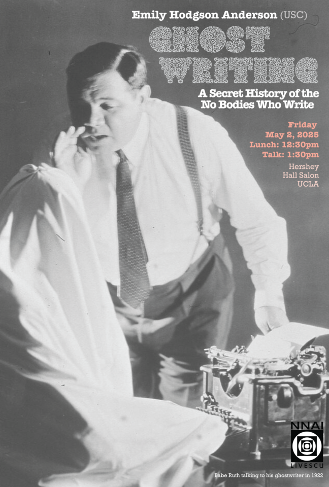

* * *

* * *

Talk by _**Emily Hogdson Anderson**,_ University of South California titled **_Ghostwriting: A Secret History of the No Bodies Who Write_**

What is ghostwriting? Understood broadly as the act of one person writing in another person’s name, the practice has—according to many ghostwriters—been around since written language itself. And yet the implementation, and acknowledgment, of this practice have varied greatly over time. Who _are_ these invisible figures? Why do they do what they do? And why do they remain disembodied—behind the scenes?

In part a cultural history of this mysterious and intuitively captivating profession, in part an exposé of how contemporary professional ghostwriting works, this public lecture uses ghostwriting to animate the questions posed by [The No-Body Problem inaugural event](https://sites.lifesci.ucla.edu/livescu/inaugural-workshop/). In one sense, ghostwriters are nobodies, the unacknowledged, disembodied figures who stand behind so much of today’s published writing. In another very important sense, they are NOT nobodies: they are both the flesh and blood figures who did the interviews and submitted the proposal and stayed up late pounding caffeine to produce the drafts, and they are the talented professionals, trained in a craft, who are proud of their accomplishments and vaunt them, to the extent they can, on their websites and c.v.s.  A ghostwriter wants you to know that he or she is not a nobody, if you are in the market to hire a professional ghost. 

As such, ghostwriters exemplify many of the tensions posed by the title of our event.  In our increasingly technological, online life, how and when do we remain aware of physical presence (our own or others)?  How does embodied interaction affect us differently than the interactions we have with others online? Are interactions ever truly “disembodied”: to what extent does physical presence, or the illusion of physical presence, make itself felt?  But ghostwriters also put pressure on the “problem” of the conference title. Asking why someone would work as a ghostwriter is also a way to ask: are there advantages to a disembodied, or seemingly disembodied, life?

* * *

### Event Details

**·** **Time:** May 2nd 2025 at 1:30 pm 

**·** **Location:** Hershey Hall Salon ([on South Campus](https://www.maps.ucla.edu/?id=2043#!m/696728?share))

**·** Lunch will be served at 12:30 pm

**Please contact marranz@socgen.ucla.edu for any questions.**

* * *
