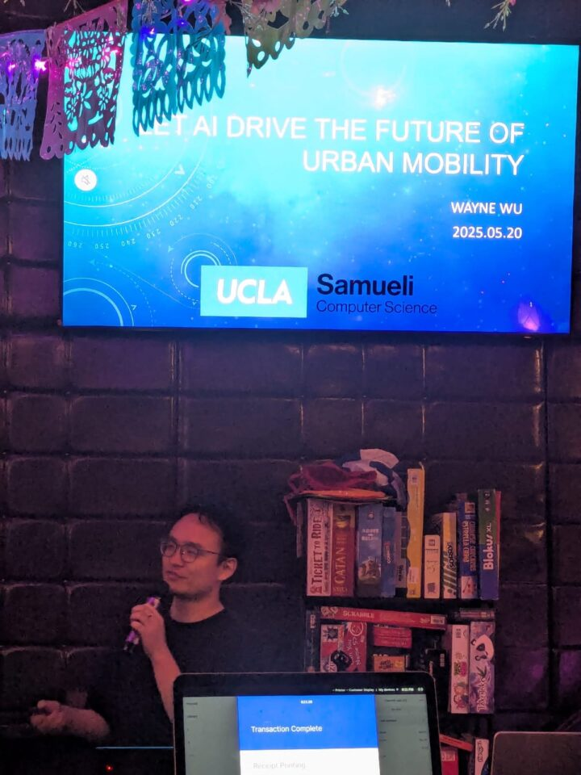

* * *

We are partnering with [@pintofscience.us](https://www.instagram.com/pintofscience.us/) through an NNAI Livescu collaborator, Wayne Wu, who will give a talk at [#Pint25](https://www.instagram.com/explore/tags/pint25/) festival.

Talk Title: Let AI Drive the Future of Urban Mobility Speaker: Wayne Wu (UCLA)

🍺 Pint of Science Los Angeles 2025 🌆  
📍 Weary Livers, Santa Monica  
📅 Tuesday, May 20, 2025  
🕕 7:00 PM – 9:00 PM

From delivery robots to intelligent scooters, AI is transforming how we navigate our cities. Join us as Wayne Wu takes us inside a massive virtual city used to train machines to handle real-world chaos—and discover how smarter mobility could make your commute smoother and our streets safer.

Come for the science, stay for the beer and brilliant conversation!

* * *

## Join Our Newsletter

\[mailerlite\_form form\_id=1\]

## Connect

**UCLA Institute for Society and Genetics**  
621 Charles E. Young Dr. South  
Box 957221, 3360 LSB  
Los Angeles, CA 90095-7221

\[gravityform id="1" title="true"\]
