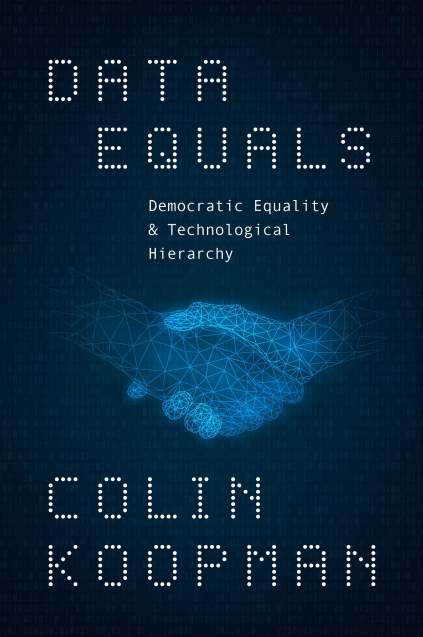

* * *

We are partnering with the [UCLA Political Science Department](https://polisci.ucla.edu/events/departmental-workshops/political-theory-workshop/) to host a talk by renowned political theorist [Prof. **Colin Koopman** (University of Oregon)](https://news.uoregon.edu/expert/colin-koopman-department-philosophy) about his latest book, [_**Data Equals: Democratic Equality & Technological Hierarchy**_](https://press.uchicago.edu/ucp/books/book/chicago/D/bo250890098.html).

In this timely and ambitious work, Koopman explores how data technologies, often taken to be neutral tools, can perpetuate inequality when built on flawed notions of algorithmic fairness. It is not enough, Koopman explains, that algorithms engage everyone’s data with the same measuring stick. Input data are all too often structured in ways that obscure and exacerbate stratifying distinctions and hierarchies. Koopman contends that we must also work to ensure that those people subject to computational assessment enter data systems on equal terms. Part philosophical argument, part practical guide (focusing on AI-driven personalization in education technology), _Data Equals_ offers novel methods for realizing democratic equality in a digital age.

* * *

#### **Event Details**

- Date & Time: October 15th 2025 at 4:00 pm

- Location: [DataX Impact Forum](https://sites.google.com/g.ucla.edu/datax-space-reservations/room-configurations?authuser=0), Murphy Hall, UCLA

- Please **[RSVP](https://docs.google.com/forms/d/e/1FAIpQLSdwdKpdjJ9L4dGMyURmgvra0bwn7XboHZE1WKBTlDE7lnBx5g/viewform?usp=header)** in advance**, there is limited seating available**

This event is part of the **[2025–26 UCLA Political Theory Workshop](https://polisci.ucla.edu/events/departmental-workshops/political-theory-workshop/)**, coordinated by **[Tejas Parasher](https://polisci.ucla.edu/person/tejas-parasher/)** and **[Natasha Piano](https://polisci.ucla.edu/person/natasha-piano/)**, and reflects our ongoing commitment to fostering interdisciplinary conversations that challenge and enrich political thought.  
  
Don’t miss this opportunity to engage with critical ideas on data, democracy, and equality.

* * *

## Join Our Newsletter

\[mailerlite\_form form\_id=1\]

## Connect

**UCLA Institute for Society and Genetics**  
621 Charles E. Young Dr. South  
Box 957221, 3360 LSB  
Los Angeles, CA 90095-7221

\[gravityform id="1" title="true"\]
