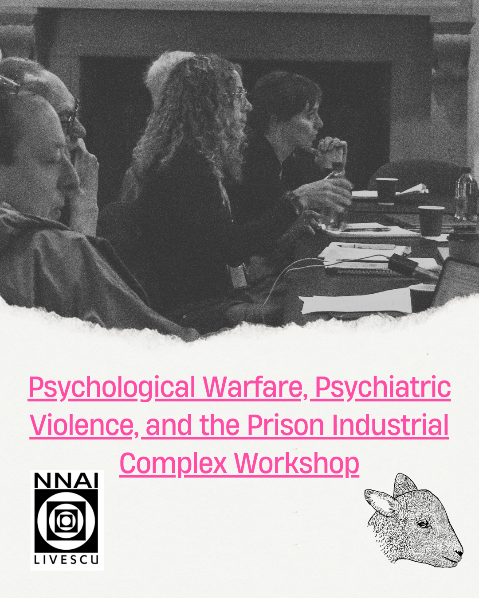

We partnered with [Dr. Danielle Carr (ISG)](https://socgen.ucla.edu/people/danielle-carr/) for a workshop on Psychological Warfare, Psychiatric Violence, and the Prison Industrial Complex, as part of her research project: Material Intelligence as Historical Problem.

In a series of sessions held at the Hershey Hall Salon in UCLA, the attendees shared their insights on the events that happened in the late ’60s and ’70s, when scientists and state agencies tried to link “violence” to the brain—especially in the wake of racial uprisings.

In the late 1960s, as “law and order” politics surged, neuroscientists began linking “violence” to the brain, claiming that racial unrest stemmed from neurological abnormalities. This research culminated in UCLA’s proposed Center for the Study of the Reduction of Violence, led by Louis Jolyon “Jolly” West—CIA operative, MK-ULTRA figure, and head of UCLA’s neuropsychiatric unit. The Center’s plans, including brain-electrode studies on incarcerated people, sparked massive protests from groups ranging from the Black Panthers to the National Organization for Women, ultimately halting its creation. Yet the broader state-funded project to neurologize and control “violence” lived on, shaping carceral and military behavioral science throughout the 1970s and 80s.

### Participants

- Danielle Carr, ISG

- Christopher Kelty, ISG

- Anthony Hatch, Wesleyan University

- Maria Cristina Mejia Visperas, USC

- Jonathan Moreno, UPenn

- Oliver Rollins, MIT

- Nigel E. Cambridge, CUNY

- Rebecca Lemov, Harvard University

- Jeremy Levenson, Yale University

- Orisanmi Burton, American University

- Delio Vasquez, NYU

- Stephen Jones

- Noah Kulwin

- Christian Hansen

- Tom O'Neil
