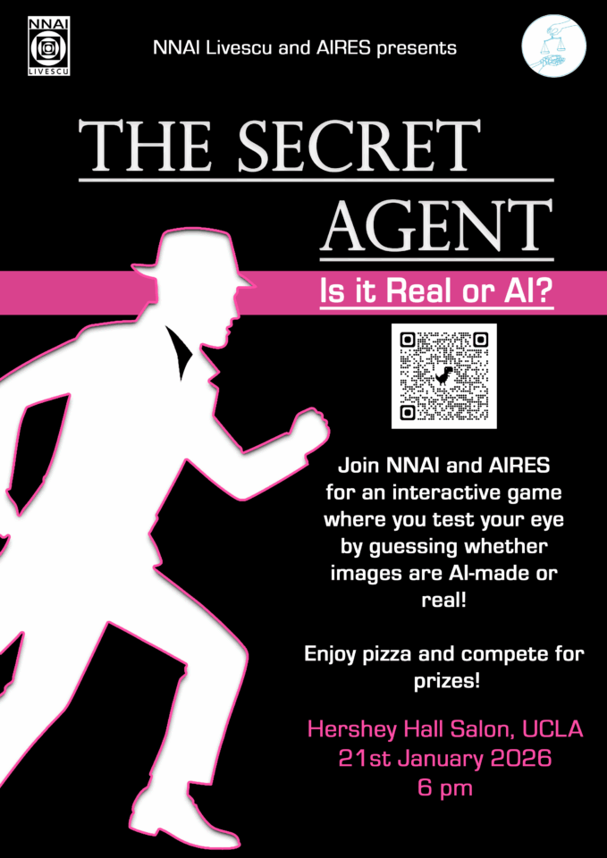

* * *

NNAI Livescu and AIRES are partnering to organize a social event at UCLA to rise awareness on AI use at the university. Participants will be playing an interactive game inspired by “Is it cake?” where participants will be tested on their skill to identify AI material. Come share your perspective, connect with other students, and enjoy pizza while learning more about AI models use on campus!"

* * *

#### **Event Details**

Please **[RSVP](https://docs.google.com/forms/d/e/1FAIpQLSdb8joKmO3mIRdQ5kLh0DCMHmCwKefFLyRHy8JHStWzDWFfZg/viewform)** in advance**, there is limited seating available**

- 🗓 **Date:** Wednesday, January 21st, 2026

- 🕛 **Time:** 6:00 – 7:00 PM

- 📍 **Location:** Hershey Hall Salon, Hershey Hall UCLA

* * *

#### **Seminar Schedule & Format**

This seminar is designed to rise awareness of undergraduate and graduate students on AI model use at the University.

After a brief initial introduction by NNAI Livescu and AIRES representatives, we will engage in a game where we will request participants to identify images generated either by a human or an AI agent. The game will be concluded with a discussion on how this technology is penetrating and impacting UCLA's teaching and learning mission.

Whether you are skeptical, excited, overwhelmed, or just curious, your voice matters. Let’s talk about what AI is doing in our classrooms and labs through community events, and what we want it to do.

* * *

## Join Our Newsletter

\[mailerlite\_form form\_id=1\]

## Connect

**UCLA Institute for Society and Genetics**  
621 Charles E. Young Dr. South  
Box 957221, 3360 LSB  
Los Angeles, CA 90095-7221

\[gravityform id="1" title="true"\]
